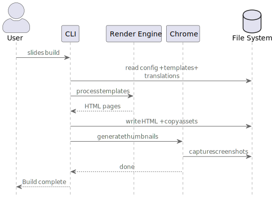

# 06. Runtime View

## 6.1 Build Process

The `slides build` command transforms templates into a static HTML presentation.

**Steps:**

1. **Load** - Read config, templates, and translations from file system
2. **Render** - Process templates with MiniJinja engine
3. **Write** - Output HTML files and copy assets
4. **Thumbnails** - Headless Chrome captures screenshots for overview page

## 6.2 Watch Mode

The `slides watch` command provides live rebuilding during development.

**Behavior:**

- Performs full build (including thumbnails) on startup
- Monitors `templates/`, `decks.yaml`, and `translations/` for changes
- Debounces file events (500ms) to batch rapid changes
- Rebuilds HTML only on change (no thumbnail regeneration for speed)

## 6.3 PDF Export

The `slides export` command generates a PDF from the presentation.

**Process:**

1. Runs full build to generate thumbnails
2. Assembles thumbnail images into PDF pages
3. Optionally encrypts PDF with password (supports print/copy restrictions)

---

*This document follows the [ARC42 architecture documentation template](https://docs.arc42.org/)*
