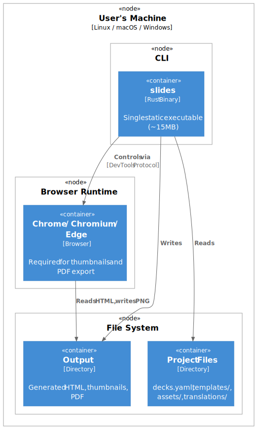
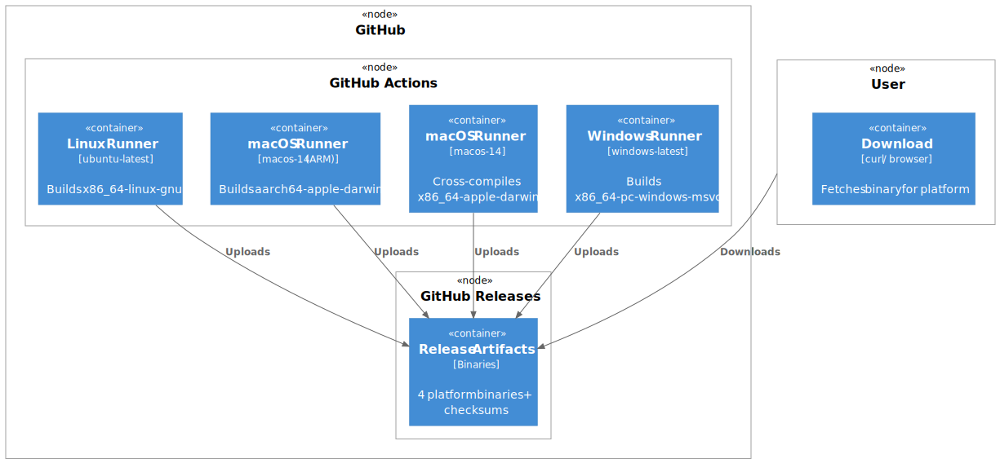

# 07. Deployment View

## 7.1 Production Deployment

slides-rs is distributed as a single static binary with no runtime dependencies.

**Deployment Characteristics:**

| Aspect | Description |
|--------|-------------|
| **Distribution** | Single binary download or install script |
| **Dependencies** | Chrome/Chromium/Edge (for thumbnails and PDF export) |
| **Installation** | Copy to PATH or use install script |
| **Configuration** | None required (project-level only) |

## 7.2 CI/CD Pipeline

Binaries are built and released via GitHub Actions.

**Build Matrix:**

| Target | Runner | Binary Name |
|--------|--------|-------------|
| `x86_64-unknown-linux-gnu` | ubuntu-latest | `slides-linux-x86_64` |
| `aarch64-apple-darwin` | macos-14 | `slides-macos-aarch64` |
| `x86_64-apple-darwin` | macos-14 | `slides-macos-x86_64` |
| `x86_64-pc-windows-msvc` | windows-latest | `slides-windows-x86_64.exe` |

**Release Trigger:** Push tag matching `v*` pattern.

---

*This document follows the [ARC42 architecture documentation template](https://docs.arc42.org/)*
